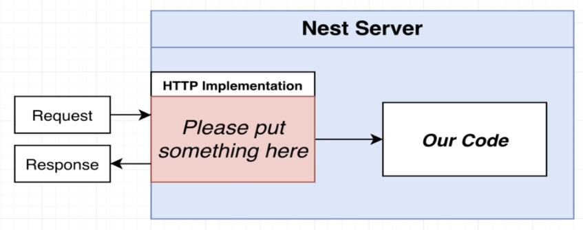

## Core concepts

### Dependencies

- `@nestjs/common` - functions, classes, etc provided from nestjs
- `@nestjs/core`
- `@nestjs/platform-express` - let nest use express for handling http requests
  - NextJS itself doesn't handle requests
    
    - choose `express` or `fastify` for HTTP implementation
    - uses express as default
- `reflect-meta` - make decorators work

### TsConfig

- `experimentalDecorators`
- `emitDecoratorMetadata`

### Components for handling request

- `Pipe` validate data contained in the request
- `Guard` make sure the user is authenticated
- `Controller` route the request to a particular function
- `Service` run business logic
- `Repository` access database
- Other Tools nest provides
  - `Modules` Groups code together
  - `Filters` Handles errors occur during request
  - `Interceptors` adds extra logic to incoming requests and outgoing responses

### Conventions

- create one class in one file
- namings
  - `main.ts`
    ```typescript
    function bootstrap() {}
    ```
  - `[controller-name].controller.ts`
    ```typescript
    class AppController {}
    ```
  - `[module-name].module.ts`
    ```typescript
    class AppModule {}
    ```

### Nest CLI

- Generator
  - Module - `nest generate module [module-name]`
    - Ex. module-name = messages
      - Creates `messages.module.ts` in `src/messages` folder
  - Controller - `nest generate controller [module-name]/[controller-name] --flat`
    - `flat` - don't create extra controllers folder
    - Ex. module-name = messages & controller-name = messages
      - Creates `messages.controller.ts` in `src/messages` folder

## Pipe

- used to validate data from incoming requests, reject if is invalid
- usually extended from built in `ValidationPipe` (can also build your own)
- Setup automatic validation
  1. Tell Nest to use global validation
     `app.useGlobalPipes(new ValidationPipe());`
  2. Create a class to describe properties the request body should have (dto)
  3. Add validation rules to the class
  4. Apply class to request handler
- dto (data transfer object)
  - Carries data between two places
  - usually classes that defines the properties that should be passed in
- third party packages
  - [class-validators](https://github.com/typestack/class-validator)
  - [class-transformer](https://github.com/cunarist/class-transform) - transform object into class instances for type safe and other features
- validation pipe flow
  1. Use `class-transformer` to turn body into DTO class instances (with validations attached)
  2. Use `class-validator` to validate the class instance
  3. If there are errors, response immediately, otherwise pass body to the request handler
- How validation pipe knows to create dto instance, when passed into the handler as Type ?
  > Typescript should be removed since no engines can run TypeScript, needs to be converted to plain JavaScript, then how does the validation pipe know to run validation by the DTO type annotation?
  ```typescript
  @Post()
  createMessage(@Body() body: CreateMessageDto) {
    return `Message added with content: ${body.content}`;
  }
  ```
  - mainly because the settings we opened in `tsconfig.json`
    - `experimentalDecorators`
    - `emitDecoratorMetadata` - causing little amount of Type information transformed into JavaScript
      ```javascript
      // Transformed JavaScript Code
      __decorate(
        [
          // Post decorator -> createMessage method
          (0, common_1.Post)(),
          // Body decorator -> first argument of createMessage method
          __param(0, (0, common_1.Body)()),
          // Leaked type information to JavaScript below (metadata)
          __metadata("design:type", Function),
          __metadata("design:paramtypes", [create_message_dto_1.CreateMessageDto]),
          __metadata("design:returntype", void 0),
        ],
        MessagesController.prototype,
        "createMessage",
        null
      );
      ```

## Services & Repositories

- services - place to put business logic
  - uses one or more repositories to find or store data
- repositories - place to put storage related logic
  - usually TypeORM entity, Mongoose schema or something similar
- having same method names in both services and repositories is common

## Error Handling

- Nest catches the error and retrieves information and response to user
  - basically status code and messages
- Nest provides predefined exceptions to throw (following http standards)
  - Ex. `NotFoundException`

## Dependency Injections

- refreshment (dependencies)
  - `MessagesService` needs `MessageRepository` in able to work correctly
  - `MessagesController` needs `MessagesService` in able to work correctly

### Inversion of Control Principle

- Classes should not create instances of its dependencies on its own
  - Bad Example
    ```typescript
    export class MessagesController {
      messagesService: MessagesService;
      constructor() {
        // Don't do this in a real application! Use dependency injection instead.
        // Controllers should not create instances of other services or repositories.
        this.messagesService = new MessagesService();
      }
    }
    ```
  - Better: Receives dependency as constructor arguments
    > Still relies on specifically `MessagesService` being passed in
    ```typescript
    export class MessagesController {
      messagesService: MessagesService;
      constructor(service: MessagesService) {
        this.messagesService = service;
      }
    }
    ```
- Best Solution - receives dependency, but doesn't specifically require `MessagesService`

  - Sample

    ```typescript
    // Just Define the interface that is needed
    // Any instance or object that satisfies this interface is ok
    interface Repository {
      findOne(id: string);
      findAll();
      create(content: string);
    }

    export class MessagesController {
      messagesService: Repository;
      constructor(service: Repository) {
        this.messagesService = service;
      }
    }
    ```

- Why this is good ? (Ex. MessagesRepository)
  - Able to use different instance as long as it satisfies the interface
  - Easy to swap between using different instances
    - Ex. In production - write to hard disk (MessagesRepository)
    - Ex. In automated test - run in memory or others faster (FakeMessagesRepository)
- Downside
  - Needs more code
  - Ex. Creating a controller without Inversion Control
    ```typescript
    const controller = new MessagesController();
    ```
  - Ex. Creating a controller with Inversion Control
    ```typescript
    const repo = new MessagesRepository();
    const service = new MessagesService(repo, ...);
    // Other repos and services that are needed ...
    const controller = new MessagesController(service, ...);
    ```
- Use Dependency Injections to solve the downsides

### NestJS Dependency Injections

- Using a Nest DI container or Injector (object)
  - list of classes and their dependencies
  - list of instances that have been created
- DI Container Flow
  - At app startup, register all classes with the container
  - Container create list of classes and their dependencies to figure out what each dependency each class has
    - Class `MessagesRepository` -> x
      ```typescript
      export class MessagesRepository {
        constructor() {}
      }
      ```
    - Class `MessagesService` -> Dependency `MessagesRepository`
      ```typescript
      export class MessagesService {
        constructor(public messagesRepository: MessagesRepository) {}
      }
      ```
    - Class `MessagesController` -> Dependency `MessagesService`
      ```typescript
      export class MessagesController {
        messagesService: MessagesService;
        constructor(public messagesService: MessagesService) {}
      }
      ```
  - Container create list of instances with required dependencies
    - Create `messagesRepository` instance (no dependencies)
    - Create `messagesService` instance (using `messagesRepository`)
    - Create and return `messagesController` instance (using `messagesService`)
  - Container will hold onto the created dependency instances and reuse them when needed
    - can be proved by sample below (using same instance)
      ```typescript
      export class MessagesController {
        messagesService: MessagesService;
        constructor(
          public messagesService: MessagesService,
          public messagesService2: MessagesService,
          public messagesService3: MessagesService
        ) {
          console.log(messagesService === messagesService2); // true
          console.log(messagesService === messagesService3); // true
        }
      }
      ```
    - Use work around to create a new instance every time (will teach later)
- Nest DI is closer to the `BETTER` approach rather than the `BEST` approach
  - Due to limitations from TypeScript making it hard to implement the `BEST` approach
  - Dependency types reference to other class(better) instead of interface(best)

### Main Benefit
- Testing App is far more easier XD
- If not a fan of testing, nest may not give u too much benefit